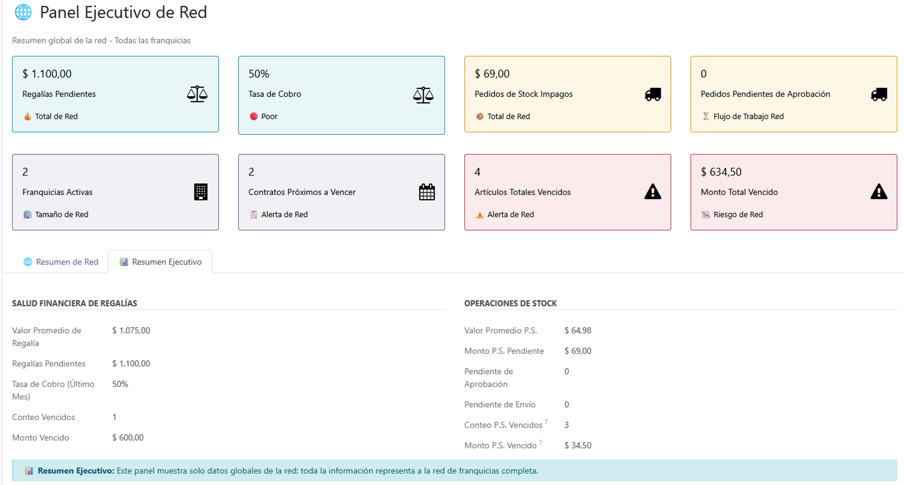
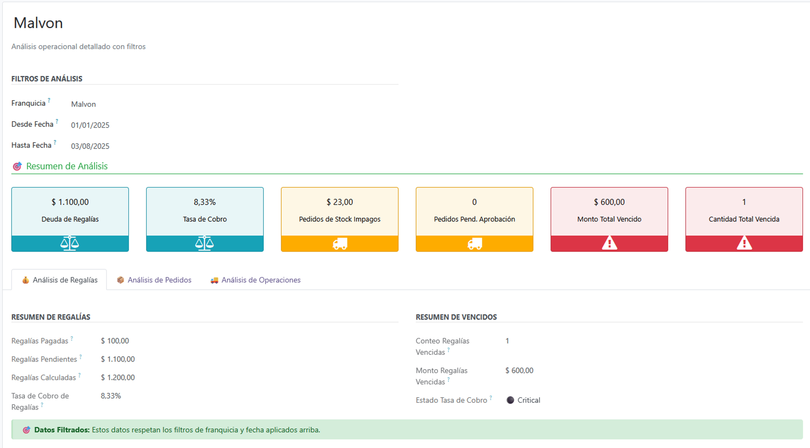
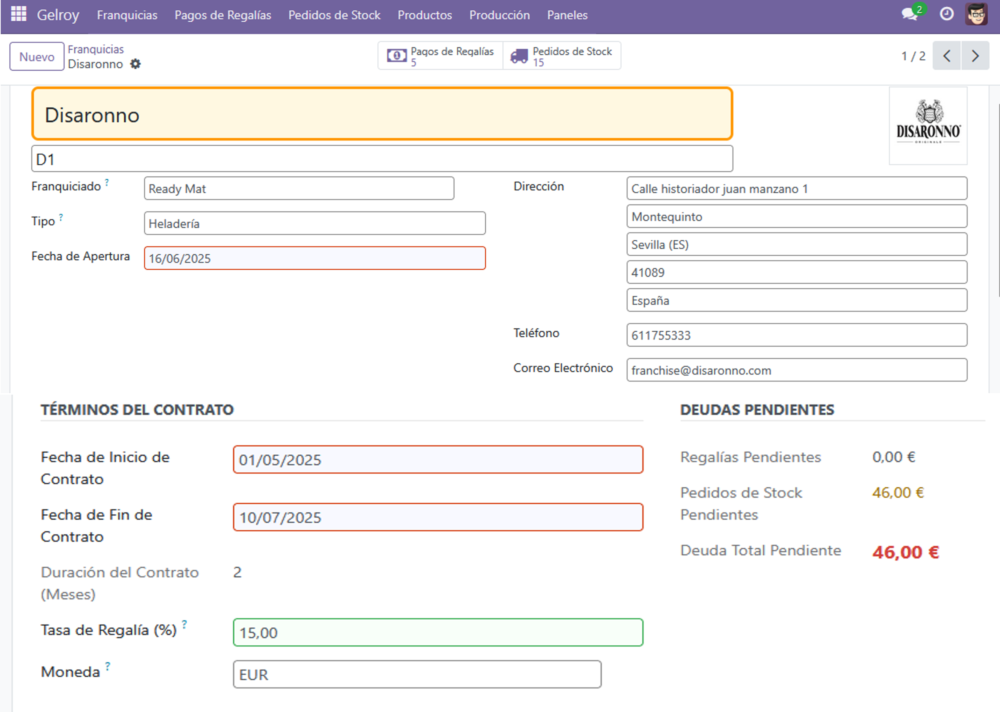
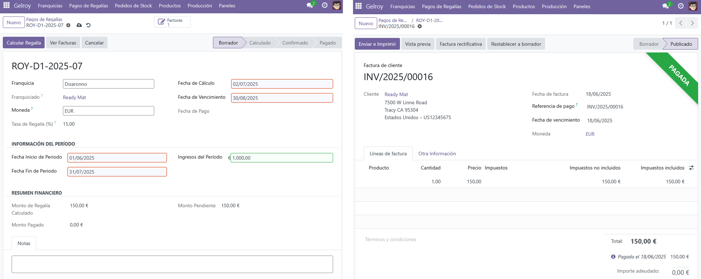
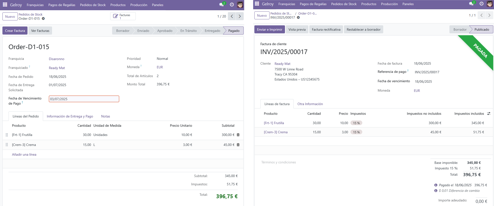

# Sistema de Gestión de Franquicias en Odoo

<p align="center">
  
</p>

Este repositorio contiene el código fuente del módulo **gelroy**, un Sistema de Gestión de Franquicias desarrollado sobre la plataforma **Odoo 17**. Este proyecto fue realizado como parte de un Trabajo de Fin de Grado en Ingeniería Informática.

El objetivo principal de este módulo es proporcionar una solución integral y centralizada para la gestión de redes de franquicias, abordando tareas críticas como la administración de contratos, el cálculo de regalías, la gestión de pedidos de stock y el análisis de rendimiento a través de dashboards.

---

## 🌟 Características Principales

### ✅ Gestión Centralizada de Franquicias
- Crea y gestiona un perfil completo para cada franquicia, incluyendo datos de contacto, contractuales y de configuración financiera.
- Cálculo automático de la duración de los contratos.

### 💸 Módulo de Regalías (Royalties)
- Registro y seguimiento del ciclo de vida de los pagos de regalías.
- Cálculo automático de montos de regalía basados en ingresos y porcentajes.
- Gestión de estados (Confirmado, Pagado, Vencido).
- Generación de facturas de regalías con un solo clic.

### 📦 Gestión de Pedidos de Stock
- Flujo de trabajo completo desde la creación del pedido por el franquiciado hasta la entrega y pago.
- Estados personalizables (Enviado, Aprobado, En Tránsito, Entregado, etc.).
- Validación de stock y deducción simplificada del inventario.

### 🏭 Planificación de Producción
- Creación de recetas con ingredientes y costes calculados.
- Planificación de la producción basada en recetas.
- Generación automática de pedidos de stock de ingredientes a partir de una planificación confirmada.

### 📊 Dashboards y KPIs
- **Panel Ejecutivo**: Visión global del rendimiento de toda la red de franquicias.
- **Panel Operacional**: Herramienta de análisis detallado con filtros por franquicia y rangos de fecha.

### 🔐 Seguridad por Roles
- Permisos diferenciados para:
  - **Gestor de Franquicia**: Acceso completo.
  - **Usuario Franquiciado**: Acceso restringido a sus propios datos.

---

## 🛠️ Tecnologías Utilizadas

- **Framework Principal**: Odoo 17 (Community Edition)
- **Lenguaje Backend**: Python 3.11+
- **Vistas y Estructura**: XML
- **Base de Datos**: PostgreSQL 15+
- **Dependencias Clave de Odoo**: `base`, `mail`, `product`, `account`, `uom`

---

## 🚀 Instalación y Configuración

### Requisitos Previos

- Odoo 17 funcionando correctamente.
- PostgreSQL 15 o superior.
- Python 3.11 o superior.

### Pasos de Instalación

1. **Clonar el Repositorio**

```bash
git clone https://github.com/tu_usuario/gelroy.git /ruta/a/tus/odoo/addons/gelroy
```


## 📚 Estructura del Módulo

El módulo gelroy sigue la estructura estándar de Odoo:

    /models: Contiene los archivos Python (.py) que definen los modelos de datos y la lógica de negocio.

    /views: Contiene los archivos XML (.xml) que definen la interfaz de usuario (formularios, listas, búsquedas, dashboards, menús).

    /security: Contiene los archivos de configuración de seguridad (ir.model.access.csv y grupos de seguridad).

    /tests: Incluye las pruebas unitarias y de integración para validar la funcionalidad del módulo.

    /i18n: Contiene los archivos de traducción (.po) para la internacionalización.

    /static: Almacena archivos estáticos como CSS, JavaScript e imágenes (ej. el icono del módulo).

    __init__.py: Archivos de inicialización de paquetes Python.

    __manifest__.py: El archivo descriptor del módulo, donde se definen sus metadatos y dependencias.

## 🖼️ Vistas Previas

### Panel Ejecutivo Global
<p align="center">
  
</p>

### Panel Operativo
<p align="center">
  
</p>

### Formulario de Franquicia
<p align="center">
  
</p>

### Formulario de Regalía
<p align="center">
  
</p>

### Formulario de Pedido de Stock
<p align="center">
  
</p>

##💡 Trabajo Futuro y Puntos de Extensión

Este proyecto sienta una base sólida que puede ser extendida en varias direcciones:

    Dashboards Avanzados y BI: Integrar herramientas más potentes para el análisis de datos.

    Portal del Franquiciado: Desarrollar un portal web para que los franquiciados puedan autogestionar pedidos, reportar ingresos y acceder a documentación.

    Integración Completa con Módulo Stock: Utilizar el flujo completo de stock.picking (albaranes) de Odoo.

    Gestión Documental: Añadir funcionalidad para gestionar contratos y otros documentos importantes.

## 👤 Autor

Franco Dell Aguila Ureña

    GitHub: [FrancoDellAguila](https://github.com/FrancoDellAguila)

    LinkedIn: [in/franco-dell-aguila](https://www.linkedin.com/in/franco-dell-aguila/)
